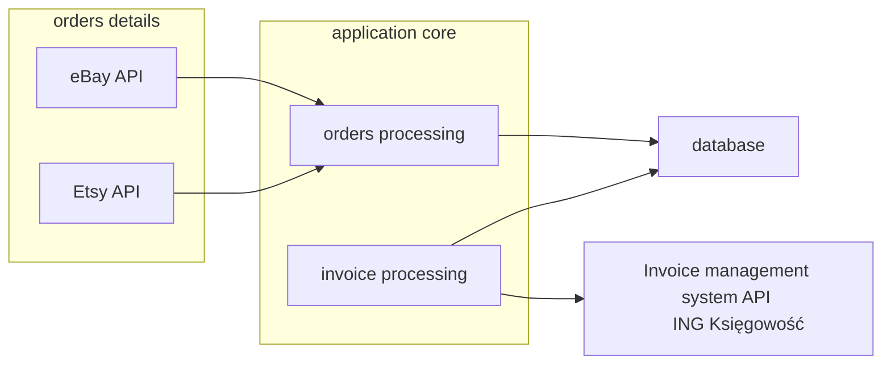

# Invoice Manager

## Overview
Application was created to automate invoice managing process. Periodically, it sends requests to Etsy and eBay APIs to retrive orders data.  
Once an order is placed the details are processed and added to MySQL database. Based on stored order details as next step is creating an invoice with invoice management system API (ING Księgowość).  
As a final step, created invoices are sent in a email message.
Application is prepared to be easily deployed in a Docker container.

## Application workflow
